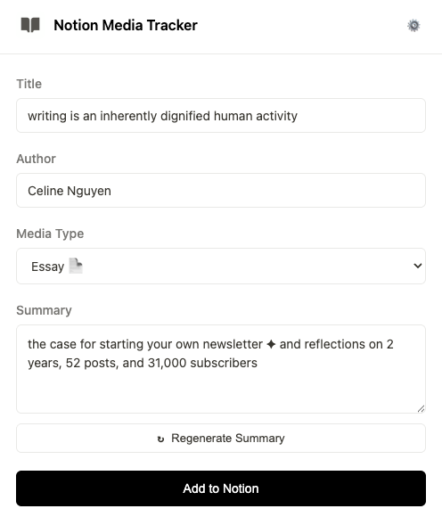
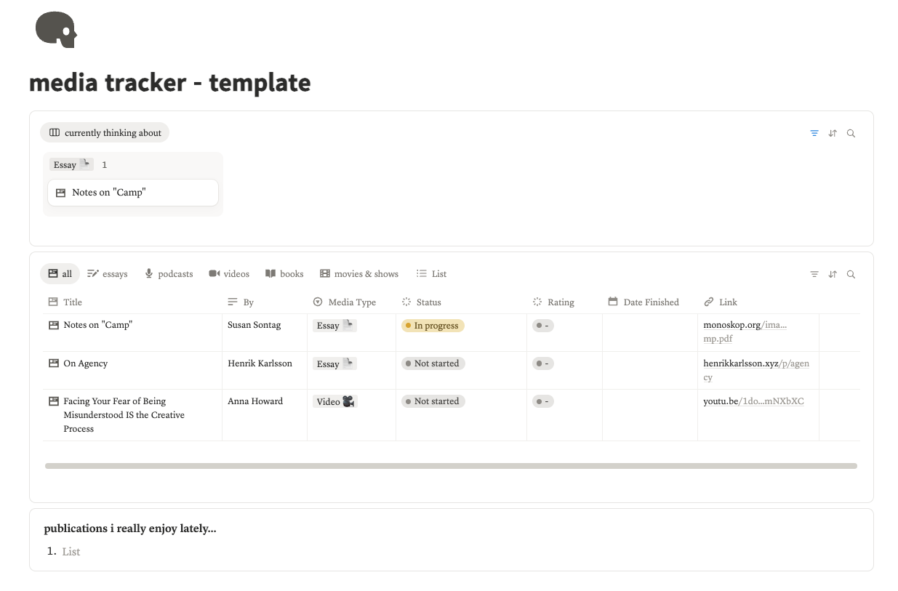

# Notion Media Importer

A Chrome extension that saves articles, essays, podcasts, videos, and books to your Notion media tracker — one click from any webpage.

---

## What it does

Whenever you come across something inspiring online - an essay, a youtube video, or a podcast,but you want to save it for later. Instead of copy-pasting titles, URLs, and authors into Notion manually, you click the extension icon and it's done. You can keep track of progress of everything easily all in one place, without getting distracted again everytime you dig through all your bookmarks or watch later playlist. 



The extension will:
- **Auto-detect** the media type (Essay, Article, Guide, Podcast, Video, Book) based on the URL
- **Extract metadata** — title, author/channel/host — from the page
- **Generate a summary** from the page's description or content
- **Send everything to Notion** with the right properties filled in
- **Duplicate check** — warns you if you've already saved the same URL

---

## What your Notion tracker looks like

The extension works with a specific Notion database structure. You can duplicate the template below to get started instantly.



Your database will have these properties:

| Property | Type | What it stores |
|---|---|---|
| Title | Title | Name of the article, video, book, etc. |
| By | Text | Author, channel, host, or creator |
| Media Type | Select | Essay 📄, Article 📑, Guide 📝, Podcast 🎙️, Video 🎥, Book 📖, Movie & Show 🎬 |
| Link | URL | Original URL |
| Synopsis | Text | Auto-generated summary |
| Status | Status | Not started, In progress, Finished |
| Rating | Status | ⭐️ through ⭐️⭐️⭐️⭐️⭐️ |
| Date Finished | Date | When you finished it |

---

## Setup guide

This takes about 5 minutes. You'll need a Notion account and Chrome.

### Step 1: Get the Notion template

**[Duplicate this template](https://pattern-bubble-b1c.notion.site/template-0e37a73dfb8982b7b2ad8113edc60eba?source=copy_link)** into your Notion workspace. This gives you the database with all the right properties already configured.

### Step 2: Create a Notion integration

This is how the extension gets permission to write to your database.

1. Go to [notion.so/my-integrations](https://www.notion.so/my-integrations)
2. Click **"+ New integration"**
3. Give it a name like "Media Importer"
4. Leave the defaults and click **"Submit"**
5. Copy the **Internal Integration Token** — it starts with `ntn_` or `secret_`

Save this token somewhere safe. You'll need it in Step 4.

### Step 3: Connect the integration to your database

This step is easy to miss — your integration can only access databases you explicitly share with it.

1. Open the Notion page where you duplicated the template
2. Click the **⋯** menu (top right of the page)
3. Click **"Add connections"**
4. Search for and select your "Media Importer" integration
5. Click **"Confirm"**

### Step 4: Find your database ID

You need the ID of the *database* inside your media tracker page (not the page itself).

1. Open the database view in your Notion template
2. Click the **⋯** menu on the database
3. Click **"Copy link to view"**
4. The URL will look like: `https://www.notion.so/your-workspace/abc123def456?v=...`
5. The database ID is the long string of letters and numbers before the `?v=` — in this example, `abc123def456`

Alternatively, you can click **"Open as full page"** on the database, and the ID will be in the URL bar.

### Step 5: Install the Chrome extension

1. Download or clone this repository
2. Open Chrome and navigate to `chrome://extensions/`
3. Turn on **"Developer mode"** (toggle in the top right)
4. Click **"Load unpacked"**
5. Select the `notion-media-importer` folder
6. The extension icon should appear in your toolbar — pin it for easy access

### Step 6: Configure the extension

1. Click the extension icon
2. Paste your **Notion Integration Token** from Step 2
3. Paste your **Database ID** from Step 4
4. Click **"Save & Continue"**

That's it! Test it out with any article, video, or podcast by clicking the icon!

---

## How it detects media types

The extension looks at the URL to figure out what kind of media you're saving:

| Type | Detected from |
|---|---|
| **Podcast 🎙️** | Spotify episodes, Apple Podcasts, Overcast, any URL with "podcast" |
| **Video 🎥** | YouTube, Vimeo |
| **Book 📖** | Goodreads, URLs with `/book/` |
| **Guide 📝** | Twitter/X, GitHub, Stack Overflow, dev.to, FreeCodeCamp, URLs with `/tutorial/`, `/how-to/`, `/docs/` |
| **Essay 📄** | Substack, Medium, WordPress, Ghost, URLs with `/blog/`, `/essay/`, `/opinion/` |
| **Article 📑** | NYT, WSJ, BBC, Reuters, CNN, Wired, The Atlantic, Wikipedia, URLs with `/news/`, `/article/` |

Unknown sites default to Essay. You can always change the type manually before importing.

## How summaries work

Summaries are generated locally — no AI, no API calls, no data leaving your browser.

The extension reads the page in this order:
1. **Meta tags** — `og:description`, `twitter:description`, or `description` (most professional sites have these)
2. **Structured elements** — HTML elements marked as excerpts, subtitles, or summaries
3. **Article paragraphs** — first few content paragraphs if nothing else is available

For **YouTube videos**, summaries are intentionally left blank since most YouTube `og:description` tags contain generic boilerplate, so the extension skips those.You can always add summaries manually before saving it to Notion.

Summaries are capped at 500 characters and cut at sentence boundaries so they read naturally.

---

## Customizing for your own database

If you want to use your own Notion database instead of the template, make sure it has these properties with **exact names and types**:

| Property name | Notion type |
|---|---|
| `Title` | Title |
| `By` | Text (rich text) |
| `Media Type` | Select |
| `Link` | URL |
| `Synopsis` | Text (rich text) |

The `Media Type` select options must match the emoji format exactly: `Essay 📄`, `Article 📑`, `Guide 📝`, `Podcast 🎙️`, `Video 🎥`, `Book 📖`, `Movie & Show 🎬`. If the emojis don't match, Notion will reject the import with a "property names don't match" error.

The `Status`, `Rating`, and `Date Finished` properties are optional — the extension doesn't populate any text in these fields, but they're useful for tracking what you've consumed.

---

## Troubleshooting

**"Property names don't match database schema"**
The select option values (including emojis) must exactly match your database. The most common issue is using the template's emojis (`Article 📑`, `Book 📖`) vs different ones. If you've customized your database, update the `<select>` options in `popup.html` and the return values in `detectMediaType()` in `popup.js`.

**"Integration not connected"**
Go back to Step 3 — the integration must be explicitly connected to your database page in Notion.

**Extension doesn't detect metadata**
Some sites block content script injection. You can always type the title, author, and summary manually.

**Summary is blank or unhelpful**
Click "↻ Regenerate Summary" to try again, or write your own. Sites behind paywalls or heavy JavaScript loading may not expose useful metadata.

---

## Project structure

```
notion-media-importer/
├── manifest.json          # Chrome extension config (Manifest V3)
├── popup.html             # Extension popup UI
├── popup.js  
├── assets/             
│   └── icon16.png             # Toolbar icon
│   └── icon48.png             # Extension page icon
│   └── icon128.png            # Chrome Web Store icon
├── book-55534E.svg        # Book icon asset
├── tests/
│   └── test-detection.html  # Browser-based test suite for URL detection
├── README.md
├── SETUP.md               # Detailed visual setup guide
└── LICENSE
```

---

License @ MIT
